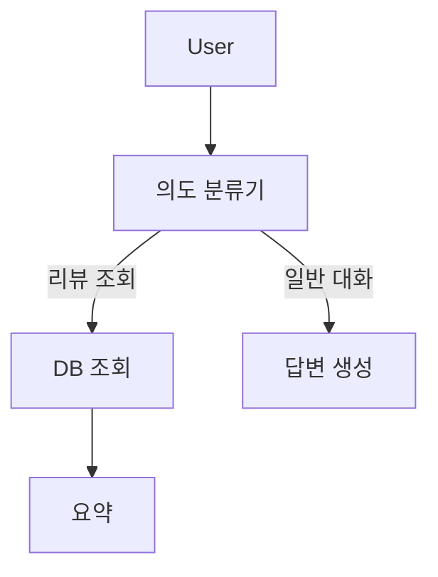

# [TIL] GitLab 코드 리뷰 챗봇: 멍청한 Router가 똑똑한 Agent가 되기까지

사내 Graphio 경진대회에서 **"AI 코드 리뷰 결과 챗봇"**을 개발하며 겪은 시행착오와 발전 과정을 정리합니다.
목표는 **GitLab 코드 리뷰 봇**이 분석한 결과를 바탕으로 사용자와 대화하며 인사이트를 제공하는 챗봇을 만드는 것입니다.

## 1. 초기 접근: 맨땅에 헤딩 (v1 - Router 방식)

LangChain에 대한 기초 지식만 가지고 시작했습니다. Gemini와 함께 Speckit을 활용해 "Vibe Coding"으로 빠르게 초기 버전을 구축했습니다.

### 초기 요구사항
1.  **세만틱 캐시**: 유사 질문(유사도 0.9 이상)은 DB 캐시에서 즉시 답변.
2.  **의도 분류 (Router)**: 사용자 질문을 4가지(일반 대화, 웹 검색, 리뷰 조회, 리뷰 상세)로 분류.
3.  **DB 조회**: 리뷰 관련 질문이면 DB에서 데이터를 가져와 LLM이 요약.

### 초기 아키텍처 (Router Pattern)
단순한 `if-else` 분기 처럼 동작하는 **Router** 구조였습니다.



### 문제점: "너무 멍청하다"
막상 돌려보니 치명적인 문제들이 발견되었습니다.

1.  **문맥 파악 불가**: "어떤 프로젝트가 있어?"라고 물으면 일반 대화로 빠져서 딴소리를 합니다.
    *   *AI*: "웹, 모바일, 오픈소스 프로젝트 등이 있습니다..." (동문서답)
2.  **기억 상실**: "A 프로젝트 보여줘" -> (결과) -> "그럼 상세 내용은?" 하면 "어떤 프로젝트요?"라고 되묻습니다.
3.  **유연성 부족**: "리뷰 목록 보여주고 그중 점수 높은 거 알려줘" 같은 복합 질문 처리가 불가능했습니다.

> **결론**: 정해진 길로만 가는 Router 방식은 사용자의 다양한 요구를 처리하기엔 너무 경직되어 있었습니다.

---

## 2. 1차 개선: 기능 확장 (v2 - Discovery 추가)

"어떤 프로젝트가 있는지 모르겠다"는 문제를 해결하기 위해 **탐색(Discovery)** 기능을 추가했습니다.

### 변경 사항
*   **Intent 추가**: `REVIEW_DISCOVERY` (프로젝트 목록 조회)
*   **노드 추가**: DB에서 프로젝트 목록을 긁어오는 `discovery_node` 추가

### 결과
```text
User: "프로젝트 목록 알려줘"
Bot: "현재 리뷰 데이터가 존재하는 프로젝트 목록입니다:
      - TDIM_R240_API_SERVICE (점수: 67, 등급: C)"
```
이제 목록 조회는 가능해졌습니다. 하지만 여전히 근본적인 의문이 들었습니다.

> **"기능이 추가될 때마다 매번 `Classifier`에 분류 규칙을 넣고, 그래프에 새로운 노드를 주렁주렁 매달아야 하나?"**

이 방식은 확장성이 너무 떨어지고 복잡했습니다.

---

## 3. 해결책 모색: ReAct Pattern & Function Calling (v3)

이 문제를 해결하기 위해 **Tool**과 **ReAct(Reasoning + Acting) 패턴**을 공부하고 적용하기로 했습니다.

### 핵심 아이디어
*   **"분류기(Classifier)를 없애자!"**
*   대신 AI에게 **도구(Tools)**를 쥐어주고, **"네가 알아서 판단해서 써"**라고 자율성을 주자.
*   **ReAct 패턴**: AI가 `생각(Thought) -> 행동(Action) -> 관찰(Observation)` 루프를 돌면서 문제를 해결.

### 변화된 구조
기존의 복잡한 분기문들이 사라지고, **Agent <-> Tools**의 심플한 순환 구조로 바뀌었습니다.

1.  **User**: "리뷰 있는 거 보여주고, 첫 번째 거 요약해줘"
2.  **Agent (생각)**: "먼저 목록을 봐야겠군. `list_projects` 도구 실행!"
3.  **Tool**: (프로젝트 목록 반환)
4.  **Agent (생각)**: "목록 확인했음. 첫 번째가 `backend-api`네. 이제 `get_review_summary` 실행!"
5.  **Tool**: (점수 및 요약 반환)
6.  **Agent (답변)**: "목록은 ~가 있고, 그중 `backend-api`는 85점입니다."

### 결론
초기 **Router(결정론적)** 방식에서 시작해 **Agent(확률론적)** 방식으로 진화하면서, 시스템의 유연성과 지능이 비약적으로 상승했습니다.
처음부터 Agent로 갔다면 디버깅이 힘들었겠지만, Router 단계에서 DB 조회 로직 등을 검증(Foundation)했기 때문에 안정적인 Agent 전환이 가능했습니다.

